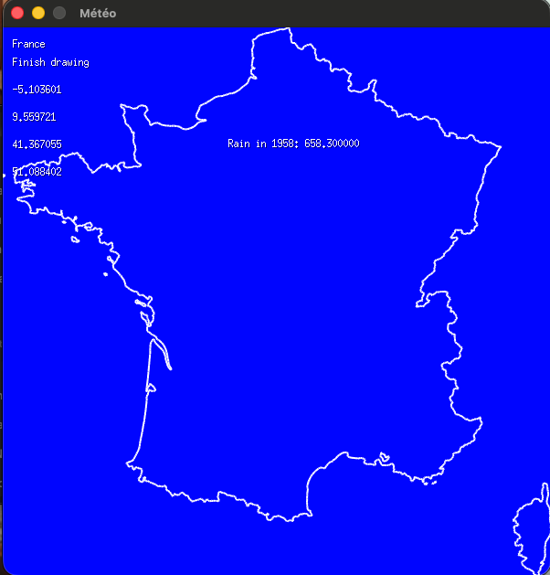
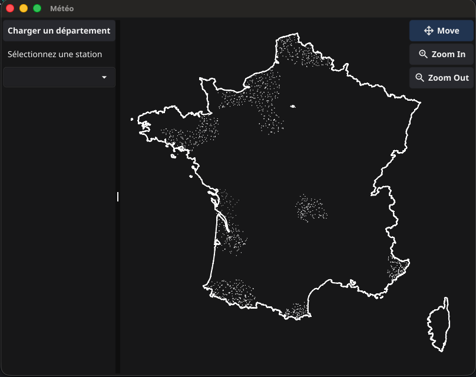
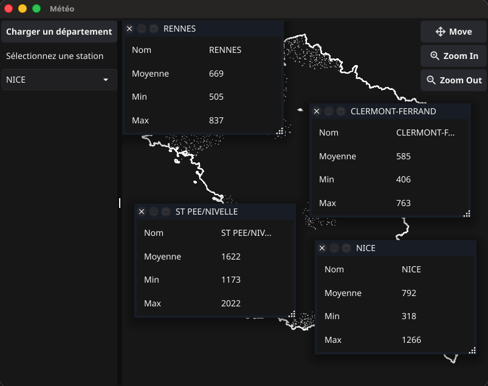

# Meteo visualiseur

Un projet en go qui affiche la pluviométrie par station / région en france métropolitaine.
Les données proviennent de [data.gouv](https://www.data.gouv.fr/datasets/donnees-climatologiques-de-base-quotidiennes)

## Lancer le projet (V1)

Il faut télécharger le fichier `Q_27_previous-1950-2024_RR-T-Vent.csv` et le placer dans le dossier `data` à la
racine.
Il faut également télécharger le fichier geo-json des frontières de la france métropolitaine [github](https://github.com/gregoiredavid/france-geojson/blob/master/metropole-version-simplifiee.geojson) et le placer dans `data`.

Ensuite lancer la commande
`go run .`

Un fichier de log est automatiquement créé à la racing du projet `app.log`

## V1

Afficher la carte de la France et le relevé pluviométrique par an d'une station

## V2

Afficher le comparatif entre 2 villes

## V3

Refonte technique complète

- utilisation de fyne en lib graphique
- téléchargement des données depuis data.gouv directement via l'app
- stockage des données au format parquet (compressé)
- utilisation de duckdb pour interroger les données

Carte intéractive

- zoom/dezoom
- Déplacer la carte
- Fenêtrage pour afficher les informations des stations
